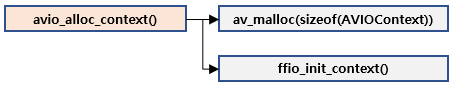
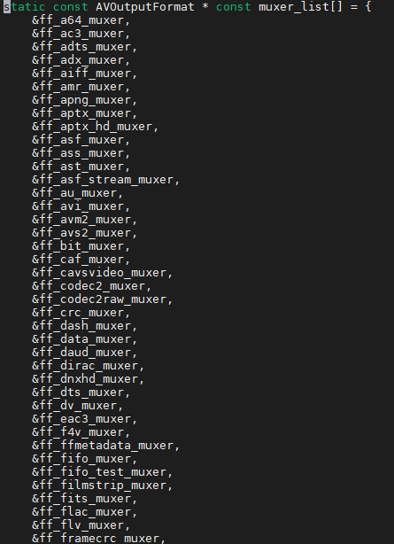
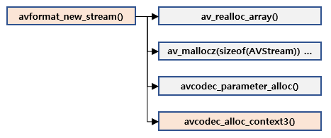
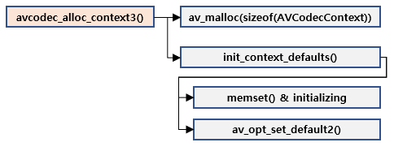

# Core Structure

## Map

## AVFormatContext

* 미디어 파일에 대한 모든 명세를 하고 있는 핵심 구조체
* I/O, Container, Codec 정보를 모두 총괄하고 있음
* 생성 : avformat\_alloc\_context\(\)
  * 구조체 메모리 할당, AVClass, default I/O setting, option parsing
* 파괴 : avformat\_free\_context\(\)

## AVIOContext, URLContext, URLProtocol

### AVIOContext

* 미디어 스트림의 I/O를 위한 구조
* 어떤 방법으로 데이터를 읽고 쓸지에 대한 문맥
* 생성 : avio\_alloc\_context\(\)
  * I/O Context 구조체 메모리 할당 및 초기화
* 파괴 : avio\_free\_context\(\)

### URLContext

I/O와 관련된 문맥을 담고 있는 구조체

* URLProtocol을 지니고 있
* 프로토콜들은 URLProtocol 타입으로 프로토 별로 정의되어 있으며, 관련 함수포인터를 지니고 있음
* 사용 가능한 프로토콜은 libavformat/protocol\_list.c 참고

* avio\_open2\(\)

### 

## AVInputFormat, AVOutputFormat

* 사할 수 있는 입출력  양
* 보유하고 있는 demuxer, muxer의 종류에 따름
* libavformat/demuxer\_list.c, libavformat/muxer\_list.c 참

## AVStream

* 미디어 스트림 추상화 구조체
* 내부에 스트림 정보 및 AVCodecContext\(코덱\)를 지니고 있음
* 생성 : avformat\_new\_stream\(\)

## AVCodecContext

* 코덱\(decoded, encoder\)과 코덱 사용을 위한 정보들을 담고 있
* 생성 : avcodec\_alloc\_context3\(\)
* 파괴 : avcodec\_free\_context\(\)

## AVPacket

* 압축된 데이터 저장 및 운반을 위한 구조체
* 생성 : av\_packet\_alloc\(\), av\_init\_packet\(\), av\_new\_packet\(\)
  * av\_packet\_alloc\(\) : 버퍼 없는 비어있는  AVPacket 구조체 할당
  * av\_init\_packet\(\) : AVPacket 필드 초기화
  * av\_new\_packet\(\) : 입력된 크기 만큼의 버퍼를 할당하여 AVPacket을 만들고 초기
* 파괴 av\_free\_packet\(\)

## AVFrame

* 비압축된 데이터 저장 및 운반을 위한 구조
* 생성 : av\_frame\_alloc\(\)
  * AVFrame allocate and initializing
  * AVFrame을 만드는 것 만으로는 내부 버퍼 할당이 이뤄지지 않으므로 별도의 할당 필요
    * av\_image\_fill\_arrays\(\) 등 호
* 파괴 : av\_frame\_free\(\)
  * av\_frame\_unref\(\)
  * AVFrame delete

