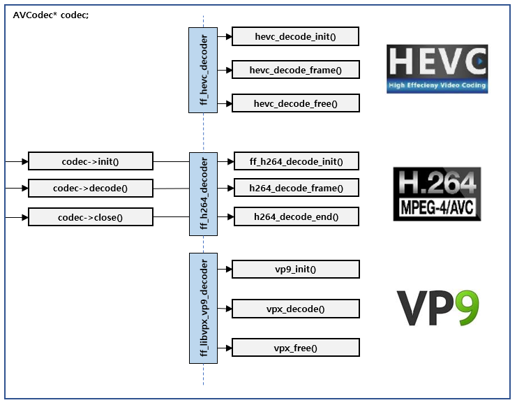

# avformat\_find\_stream\_info\(\), avcodec\_find\_decoder\(\), avcodec\_open2\(\)

## avformat\_find\_stream\_info\(\)

* 일부 파일의 경우 헤더에 기재된 정보가 부족한 경우가 있음
* 이 경우, AVFormatContext를 이용해 실제 패킷 드레인 및 디코딩을 일부 진행하여 필요한 정보를 채워넣을 수 있음
* 정보 필요 시, 헤더 -&gt; 패킷 -&gt; 프레임 순으로 순차적으로 시도 

## avcodec\_open2\(\)

* AVCodecID로 AVCodec을 찾아서 코덱 Context를 활성화하는 과

