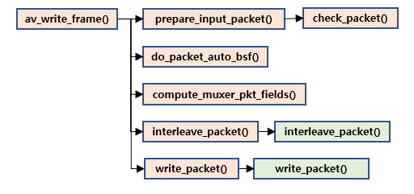

# av\_write\_frame\(\) / av\_interleaved\_write\_frame\(\)

* 패킷을 확인하고 pts, dts, duration 등을 확인한 후 실제 write를 진행

* av\_interleaved\_write\_frame\(\)의 경우 위 과정과 대부분 동일하나 write\_packet\(\) 호출 전 interleave\_packet\(\)을 호출하는 과정이 있음.

