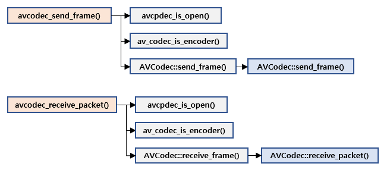
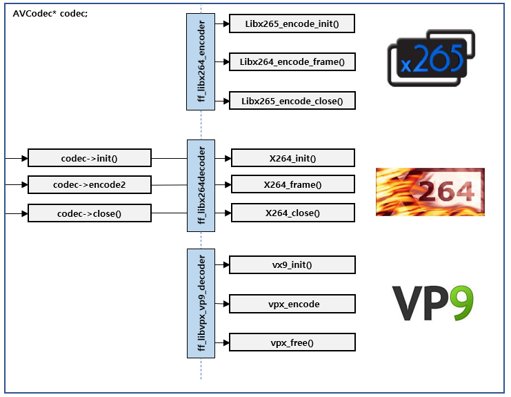

# avcodec\_send\_frame\(\) / avcodec\_receive\_packet\(\)

* decoding과 마찬가지로 api가 대체되었음

* 하지만 아직 많은 encoder에 send\_frame\(\), receive\_packet\(\)이 구현되어 있지 않아, 호환성을 위해 do\_encode\(\)를 호출하여 변경된 function을 지원하지 않는 인코더도 하위호환성을 지닐 수 있도록 코드가 되어 있음
* 주요 코덱의 함수 매핑은 아래와 같

