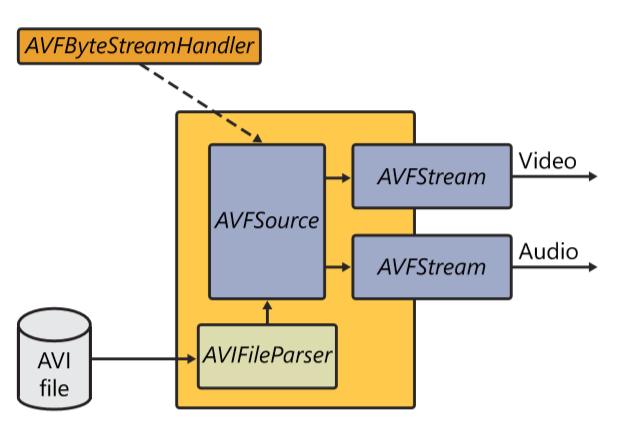
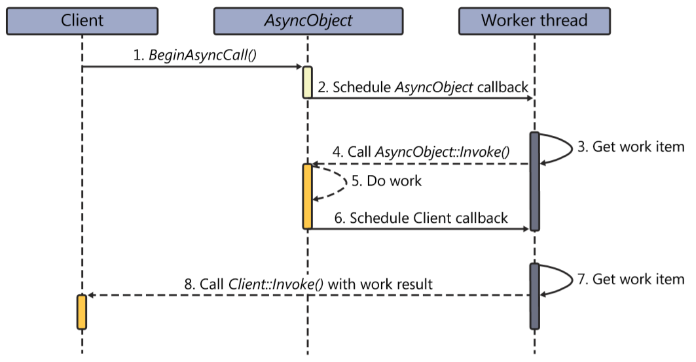
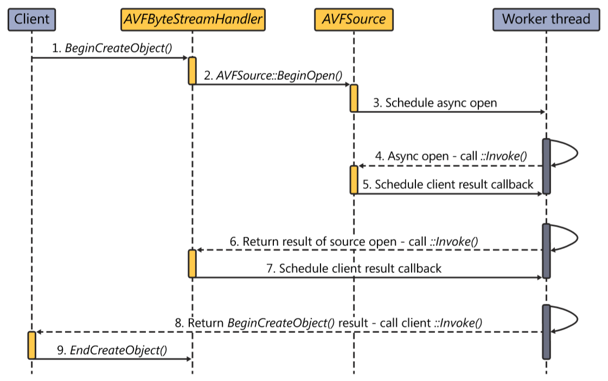
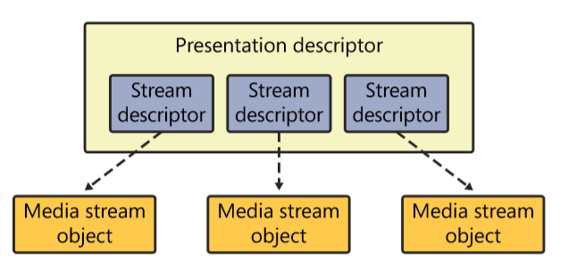
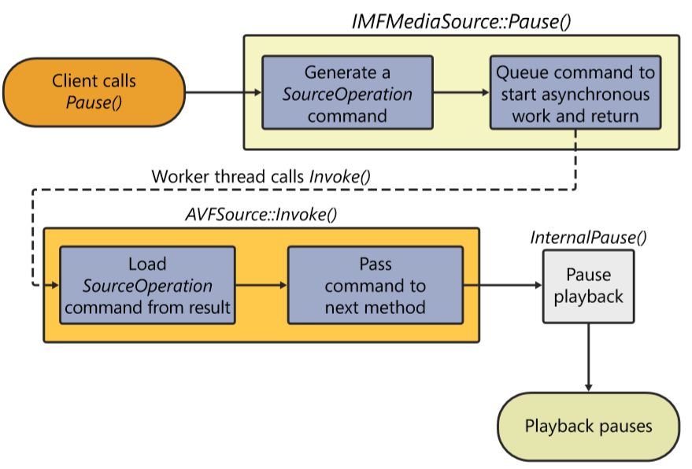
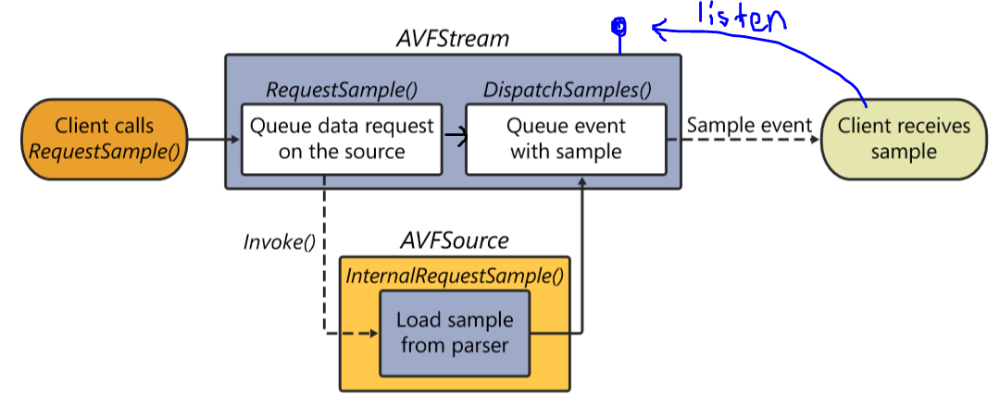

# Media Foudation Sources

## Media Source Overview

**Media Source**

* MF topology로 media data를 전달하는 역할
* data origin으로 부터 media file의 metadata를 추출 및 전처리
* pulling을 기반으로 함
  * different than DirectShow, where most source filters push data to the graph
  * the Media Foundation pipeline uses a **`pull architecture`**, where the media session pulls samples from each node as needed
* DirectShow의 Source Filter에 해당하며, stream object는 Source Filter의 Pin에 비유할 수 있음


**Media Source Object Structure**

  

* 미디어 소스를 만들기 위한 class factory 역할의 **Byte Stream Handler Object**가 있음
* **Media Source Object**는 다음의 인터페이스를 필수적으로 구현해주어야 함
  * **`IMFMediaSource`**
  * **`IMFMediaEventGenerator`** 
  * **`IMFMediaStream`**

## Asynchronous Call Pattern

Media Foundation이 DirectShow의 가장 큰 차이 중 하나는 Media Foundation의 대부분의 call은 asynchronous call이라는 것으로 Worker Thread Object를 이용해 asynchronous call 호출.


Your components do not need to explicitly create separate threads to execute work concurrently. Instead, **they can rely on the helper worker thread queues and worker thread objects provided for you.**




> **On Client Thread**
>
> * Client
>   * BeginAsyncCall\(\)로 asynchronous work request를 요청
>   * callback을 받기 위한 Client의 IMFAsynceCallback interface를 같이 전달
> * AsyncObject
>   * 요청받은 work request를 worker thread object의 work queue에 scheduling
>   * **"나 \[work\]을 해야하는데, 대신 좀 실행시켜 줄래?"**
>   * callback을 위해 AsyncObject의 IMFAsyncCallback interface를 같이 전
>   * client thread 반환

> **On Worker Thread \# 1**
>
> * Worker thread
>   * internel MF component that stores various asynchronous requests in an internal queue and executes the requests on the actual worker thread by calling the asynchronous object's Invoke\(\) method.
>   * worker thread  object는 work queue에 queuing 되어있는 work을 순차적으로 worker thread에 태워 실행시켜 줌
> * AsyncObject
>   * AsyncObject는 asynchronous functionality를 구현해둔 MF component
>   * work request는 AsyncObject의 IMFAsynceCallback::Invoke\(\)를 통해 이루어 짐.
>   * work이 끝난 후 client callback work request를 다시 Worker thread에 scheduling
>   * **"나 일 다했는데, 결과 좀 client한테 통지해줄래?"**

> **On Worker Thread \# 2**
>
> * Worker thread
>   * work queue에서 client callback work request를 꺼내고, 위와 같은 방식으로 Client의 IMFAsynceCallback::Invoke\(\)를 실행시켜


**make sure that both Client and AsyncObject are thread safe.** To avoid a race condition, you need to use some sort of thread synchronization mechanisms inside of the various functions of these class. \(**Active Template Library, ATL**\)


이러한 asynchronous pattern은 synchronous pattern에 비해 다소 복잡하지만, 오랜 시간이 소요되는 작업에 있어 유용.

## Instantiating a Media Source

MF 에는 Media Source를 생성하는 과정은 다음의 단계들을 포함

* identifying the **source of the data**
* identifying the **container format** of the data stream
* **instantiating** the Media Source

Media Source를 만드는 방식은 크게 3가지가 있음.

* **CreateObjectFromURL\(\)** / ****BeginCreateObjectFromURL\(\)
* CreateObjectFromByteStream\(\) / BeginCreateObjectFromByteStream\(\)
* COM

Media Source를 만드는 데는 다음과 같은 객체들이 사용됨.

* **Scheme Handler Object**
  * Create Byte Stream Handler
* **Byte Stream Handler Object**
  * Media Source를 인스턴스화해주는 class factory 역할의 helper object
  * file extension이나 protocol을 기반으로 registry를 조회하여 만들어 지며, 연관된 source를 인스턴스화
  * 특정  Byte Stream Handler가 불리기 위해서는 사전에 registry에 등록하는 과정이 필요



* Create **`Source Resolver`**
* **IMFSourceResolver::CreateObjectFromURL\(LPCWSTR pwszURL\)**
  * identifying the **source of the data**
    * parse the URL to discover the **scheme \(file: / http: / https: / rtsp: \)**
    * Create **`Scheme Handler Object`** and passes the URL to it.
  * identifying the **container format** of the data stream
    * Create **`Scheme Handler Object`** and passes the URL to it
      * parse the URL to discover the **file extensions\( .avi, .mov, .mp3, and so on \)**
      * Create **`Byte Stream Reader`** to load the media data
      * Create **`Byte Stream Handler`** for specific file format\(.avi, .mov, mp3, and so on\)
  * instantiating the Media Source
    * passes **Byte Stream Reader** to **Byte Stream Handler**
    * **instantiates** and **initializes** a source



* **Create IMFByteStream object\(Byte Stream Reader\)** to load the media data
  * MFBeginCreateFile\(\)
  * MFCreateFile\(\)
  * MFCreateTempFile\(\)
* Create **Source Resolver**
* use **IMFSourceResolver::CreateObjectFromByteStream\(IMFByteStream\)**
  * 어떤 과정을 거치는지 설명이 되어있지 않음.



* Instantiate the media source directly as a well-known class or COM component.




**Media Foundation과 Windows Registry**

source resolver는 registy에서 필요한 MF 객체를 찾기 위해 standard MF location을 조회하며, 총 2가지 위치가 있

* per user
  * HKEY\_CURRENT\_USER\SOFTWARE\Microsoft\Windows Media Foundation
* all user

  * HKEY\_LOCAL\_MACHINE\SOFTWARE\Microsoft\Windows Media Foundation

* 특정 Scheme/extentions에 따른 객체를 찾는 레지스트리 위치

  * HKLM\SOFTWARE\Microsoft\Windows Media Foundation\SchemeHandlers\\[scheme\]\"{CLSID}"="{Scheme Handler Description}"
  * HKLM\SOFTWARE\Microsoft\Windows Media Foundation\ByteStreamHandlers\\[extention\]\"{CLSID}"="Byte Stream Handler Description}"

 

* 동일한 extention에 여러 Byte Stream Handler를 가질 수는 있지만, 별도의 merit value가 없어 Microsoft media sources가 먼저 시도된 후, 그 이후 어떤 source로 먼저 시도될 지는 지정할 수 없다.

위 과정과 별개로 CLSID를 이용햐 COM object의 호출을 위해, regsve32.exe 등을 이용한 CLSID와 dll 간의 연결도 필요.


## Byte Stream Handler Object

* IMFByteStreamHandler implementation
  * instantiate an MF source
  * supports asynchronous instantiation
    * useful for creating sources for media that can block or take a long time to load.



## Media Source

이렇게 생성된 Media Source는 크게 3가지 기능을 가지고 있음

* Media Source Object
  * implements the **`IMFMediaSource`** interface
  * main driving component
  * initialize File Parser object/Media Stream objects
* Media Stream Objects

  * implements the **`IMFMediaStream`** interface
  * sample streaming

## IMFMediaSource

Media Source Object의 **`IMFMediaSource`** interface는 기능적으로 다음과 같이 분류할 수 있다.

* **initialize and shut down function**
  * IMFMediaSource::CreatePresentationDescrptor\(\)
  * IMFMeidaSource::GetCharacteristics\(\)
  * IMFMediaSource::ShutDown\(\)
* **command function**
  * IMFMediaSource::Start\(\)
  * IMFMediaSource::Pause\(\)
  * IMFMediaSource::Stop\(\)
* **media event generator function**
  * IMFMediaEventGenerator::BeginGetEvent\(\)
  * IMFMediaEventGenerator::EndGetEvent\(\)
  * IMFMediaEventGenerator::GetEvent\(\)
  * IMFMediaEventGenerator::QueueEvent\(\)
* **many other internal functions**

\*\*\*\*

### Initailizing

Media Source 사용 전, 파일의 data stream을 찾아 상응하는 **`IMFMediaStream`**을 expose하는 Media Stream Object를 만드는 과정이 필요.

* ByteStreamHandler는 Media Source에 Async하게 파일을 열어줄 것을 요청
* AsyncCallback으로 Invoke가 불리고, Open 과정 시작
  * File Parser를 이용 파일 헤더 파싱
  * stream 정보를 읽어 각각의 stream descriptor들을 만듬
  * stream descriptor들과 다양한 정보들을 담아 presentation descriptor를 만듬
  * 각각의 stream descriptor에 상응하는 Media Stream Object를 만듬
* 결과를 async callback을 통해 return

**Presentation Descriptor**

* Presentation란 동일한 pts를 공유하여 동기화되어야 하는 스트림들의 그룹
* 미디어 파일의 헤더를 파싱하여 stream descriptor, duration 등 다양한 정보를 정리하여 만듬
* implements **`IMFPresentationDescriptor`**
  * select\(activate\) or deselect\(deactivate\) streams
  * extract the number of streams
  * access individual stream
* contains several Stream Descriptor objects
* file -&gt; parsing -&gt; stream descriptors, duration, and so on -&gt; grouping -&gt; presentation

**Media Stream Objects**

* stream descriptor를 정리하여 만듬
* implements **`IMFStreamDescriptor`**
  * determine the media type for the stream
  * receive request for samples and pass those request to the underlying source
  * get the sample from the source, and then send them back out
  * also uses asynchronous architecture

 


### Asnchronous Source Command Functions

main command functions도 역시 asynchronous하게 동작.

* client가 source에게 command function을 호출하고, source는 이러한 command operator \(pause, starting platback, and so on\)를 만들어 work thread에 scheduling한다.
* work thread에 의해 command operator를 담은 source의 callback이 Invoke\(\)로 불려 command를 처리하는 함수가 실행된다.
* Stop\(\)은 아래 Pause\(\)와 거의 유사하고, Start\(\)의 경우 추가적인 arguments 전달이 필요하단 것 외에 큰 틀에서 차이는 없다.



## IMFMediaEventGenerator

MF의 비동기 환경에서 events는 중요한 역할을 한다.

Media Source에는**`IMFMediaEventGenerator`**를 구현한 **`Media Event Generator object`**가 있다.

IMFMediaEventGenerator는 다음과 같은 4개의 mothod가 존재

* IMFMediaEventGenerator::QueueEvent\(\)
  * 이벤트 발생 시, event queue에 event를 queing
* IMFMediaEventGenerator::BeginGetEvent\(\)
  * 자신의 callback을 Media Event Generator object에 넘겨 async하게 event 통지를 해줄 것을 요청
* IMFMediaEventGenerator::EndGetEvent\(\)
  * 통지 받은 event의 처리가 완료되었음을 async하게 Media Event Generator object에게 전달
* IMFMediaEventGenerator::GetEvent\(\)
  * synchronously retrieve the next event from the event queue

Media Source는 다양한 이벤트\(stream discovery, start and stop, and so on\)의 발급주체로, Media Source의 인터페이스인 IMFMediaSource와 IMFMediaStream은 이를 위해 IMFMediaEventGenerator를 상속받고 있다.

위 인터페이스 구현은 Media Foundation에서 제공하는 **helper class와 objects를 이용하여 쉽게 구현할 수 있다.**

* MFCreateEventQueue\(&m\_pEventQueue\)
  * event queue that will execute all of the source's IMFEventGenerator duties

```cpp
//
// Begin processing an event from the event queue asynchronously
//
HREULST MediaSource::BeginGetEvent(
                IMFAsnycCallback* pCallback,
                IUnknown* punkState)
{
  HRESULT hr = S_OK;
  
  // m_pEventQueue는 MFCreateEventQueue(&m_pEventQueue)로 만들어 둠
  CComPtr<IMFMediaEventQueue> pLocQueue = m_pEventQueue;
  
  do {
    CComCritSecLock<CComAutoCriticalSection> lock(m_critSec);
    
    hr = CheckShutdown();
    BREAK_ON_FAIL(hr);
    
    // 인자만 전달하면, event queue object가 알아서 queue의 event를 담아
    // work queue에 scheduling 해줄 
    // event queue가 비었을 경우는 어떻게 처리될까?????
    hr = pLocQueue->BeginGetEvent(pCallBack, punkState)
  } while (false)
  
  return hr;
}
```

## IMFMediaStream

**Sample Streaming**

Media Source는  **`IMFMediaStream`**를 통해 요청 시 downstream으로 Sample을 내보내야 함.

* IMFMediaStream::RequestSample\(\)로 data 요청을 받을 시, SourceOperationalNeedsData를 담아 asynchronous work 요청
* worker thread는 source의 Invoke\(\)를 호출하고 source는 parser로 부터 sample을 뽑아 stream object로 DeliverSample\(\)을 함
* DispatchSamples\(\)를 호출하며, 이는 MEMediaSample event로 sample을 담고 event queue에 담음
* source의 IMFMediaEventGenerator를 listening하고 있던 client는 event와 함께 sample을 받
* DispatchSamples\(\) 호출 시, buffer가 빈 경우 event를  generating 하도록 하여 buffering을 구현할 수 있음



