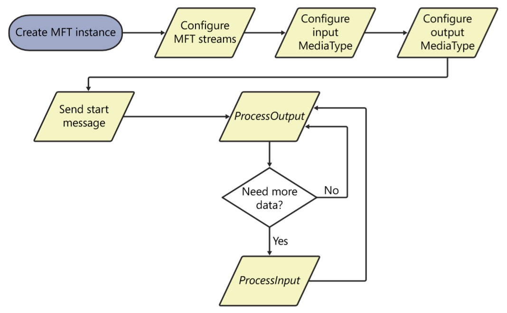
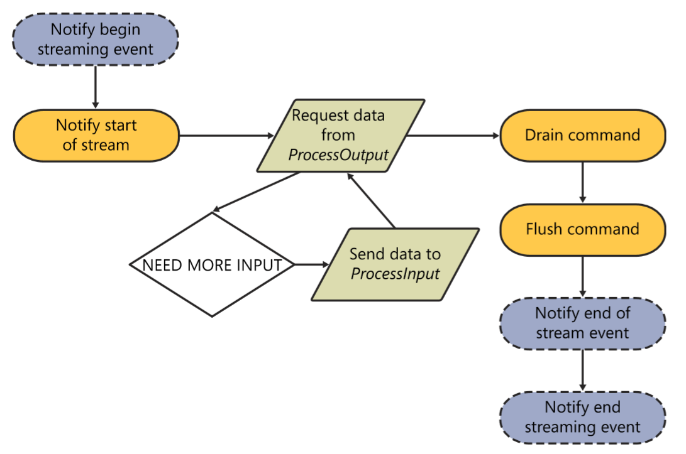

# Media Foundation Transforms

## MFTs Overview

* COM object that process data that flow through them
* have  1 or more input/output data stream
* processing data : decoding, encoding, multiplexing, de-multiplexing, DSP\(digital signal processing\)
* **isolated component** that don't know anything about their environment
  * allows you to load and use MFTs outside of MF topology
* every MFT must implement the **`IMFTransform`** interface

## 2 Behavior Model

* Synchronous model
  * this chapter focus this model \(more common case\)
* Asynchronous model
  * discussed 'Custom Media Session'

## Load and Use MFT \(order can be varied by client\)

* instantiate
  * COM
  * **`MFTEnum()`** function
  * 두 방법 모두 결국 registry를 참조하므로 사용을 위해서는 registry에 등록을 해주어야 한다
* set streams
  * query for the number of streams it support
  * configure input/output media types of the MFT on every stream
* sends a start message to the MFT indicating that it is about to start receiving data
* call **ProcessOut\(\)** to get output data
  * has data to return
    * returns data
  * need more data
    * return error
    * client calls MFT's **ProcessInput\(\)**
* client passes data to the next MFT with the next MFT's **ProcessInput\(\)** call

## IMFTransform

* defines how a client can communicate with the MFT
* fairly large, but don't need to implement every single function in it
  * rarely or not use
  * deprecated
* 4가지 기능으로 크게 분류 가능

  * Stream Configuration and Handling
  * Media Type Configuration
  * Data Processing and Messaging
  * Status Query and event

### Stream Configuration and Handling

* **add, remove, and configure the number of input and output stream**
* MF streams are implemented as seperate objects, but conceptually equivalent to DirectShow pins
* some MFTs can dynamically change the number of input/output streams based on internal logic
* media type is used to negotiate the format between the two components that the stream connect
* 다음의 methods가 중점 \(스트림 지원 갯수 확인 및 버퍼 요구사항 점검\)
  * **GetStreamLimits**\(DWORD\* in\_min, DWORD\* in\_max, DWORD\* out\_min, DWORD\* out\_max\)
  * **GetStreamCount**\(DWORD\* in\_num, DWORD\* out\_num\)
  * **GetInputStreamInfo**\(DWORD stream\_id, MFT\_INPUT\_STREAM\_INFO\*\)
  * **GetOutputStreamInfo**\(DWORD stream\_id, MFT\_OUTPUT\_STREAM\_INFO\*\)

### Media Type Configuration

* **configure an MFT** and **negotiate the connection**
* used by client to discover which media types are supported and to establish the connection
* 다음의 methods가 중점

  * **GetInputAvailableType**\(DWORD stream\_id, DWORD type\_index, IMFMediaType\*\*\)
    * CBasePin::GetMediaType\(\), 특정 input stream에서 지원하는 미디어 타입 리스트 추출
  * **GetOutputAvailableType**\(DWORD stream\_id, DWORD type\_index, IMFMediaType\*\*\)

    * CBasePin::GetMediaType\(\), 특정 output stream에서 지원하는 미디어 타입 리스트 추출

  * **SetInputType**\(DWORD stream\_id, IMFMediaType\*, DWORD MFT\_SET\_TYPE\_FLAGS\)
  * **SetOutputType**\(DWORD stream\_id, IMFMediaType\*, DWORD MFT\_SET\_TYPE\_FLAGS\)

  * **GetInputCurrentType**\(DWORD stream\_id, IMFMediaType\*\*\)
  * **GetOutputCurrentType**\(DWORD stream\_id, IMFMediaType\*\*\)

### Data Processing and Messaging

* data processing functions are used to send data for processing to MFT
* messaging functions are used by the client to send various commands and status message to MFTs
* In contrast to DirectShow filters, MFTs do **not expose methods that allow a client to control them**. Instead, MF client **send command events**
  * no Run\(\), Flush\(\), ..
* Data Processing function은 다음을 보자
  * **ProcessInput**\(DWORD stream\_id, IMFSample\* pSample, DWORD dwFlags\)
  * **ProcessOutput**\(DWORD dwFlags, DWORD cOutputBufferCount, MFT\_OUTPUT\_DATA\_BUFFER\*, DWORD MFT\_PROCESS\_OUTPUT\_STATUS\)
* Messageing function은 다음을 보자
  * **ProcessMessage**\(MFT\_MESSAGE\_TYPE eMessage, ULONG\_PTR ulParam\)

### Status Query and Event

* used by the clients to get the capabilities and custom behavior exposed by the MFT
* used to query it for status and to send events
* 다음의 function들을 보자
  * **GetAttribute**\(IMFAttribute\*\* pAttributes\)
    * **MF\_TRASFORM\_ASYNC\_UNLOCK**이 setting되어 있어야 asynchronous processing model 사용 가
  * GetInputStatus\(DWORD stream\_id, DWORD\* MFT\_INPUT\_STATUS\_FLAGS\)
  * GetOutputStatus\(DWORD stream\_id, DWORD\* MFT\_OUTPUT\_STATUS\_FLAGS\)
  * ProcessEvent\(DWORD stream\_id, IMFMediaEvent\* pEvent\)
  * SetOutputBounds\(LONGLONG earliest\_ts, LONGLONG latest\_ts\)

